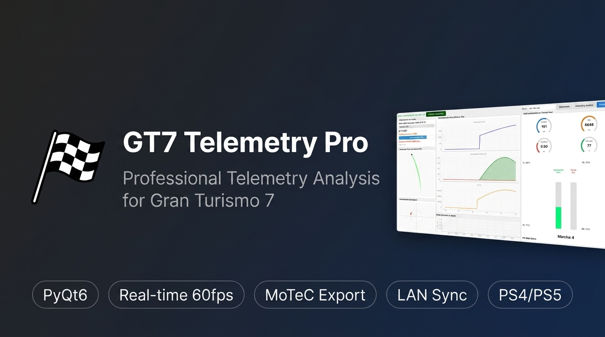
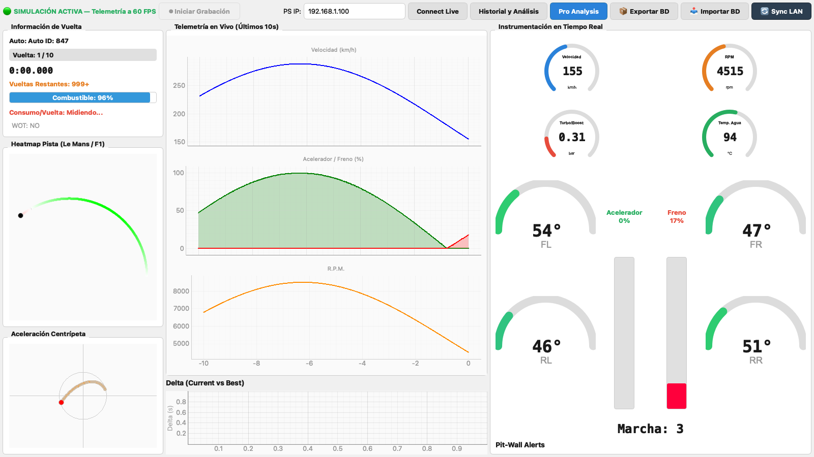

<div align="center">
  
  <h1>🏁 GT7 Telemetry Pro: F1 & Le Mans Edition</h1>
  
  <p>
    <b>Convierte tu Gran Turismo 7 en un simulador de telemetría profesional.</b><br>
    <i>Inspirado en los sistemas de muro de boxes de la vida real (MoTeC i2 / Atlas).</i>
  </p>

  <p>
    
    
    
    
    
    
  </p>
</div>



Una plataforma analítica de código abierto diseñada para extraer y transformar los datos crudos del **Gran Turismo 7** (PS4/PS5) en una consola de ingeniería virtual del más alto nivel. 

> 💡 **Nota de diseño:** La aplicación cuenta con un esquema de colores "Modo Diurno" (Daylight Mode) de alto contraste, diseñado específicamente para ser visible bajo luz natural brillante, típico en muros de boxes y *paddocks* profesionales. Todos los componentes utilizan un sistema de tokens de diseño centralizado (`ui/theme.py`) para garantizar uniformidad visual en cualquier plataforma.

---

## 🌟 Características Principales

| Funcionalidad | Descripción |
| :--- | :--- |
| **Telemetry Dashboard** | Visualiza a 60 FPS la telemetría en tiempo real: pedales, marchas, volante y g-forces sin interrupciones (*Zero-stutter*). |
| **Instrumentación Circular** | Cluster de 4 medidores circulares (Velocidad, RPM, Turbo/Boost, Temp. Agua) dibujados nativamente con QPainter. |
| **Barra de Menú Nativa** | Integración completa con el menú superior de macOS y la barra de sistema de Windows (`QMenuBar` con accesos rápidos y chequeo de versión). |
| **Análisis Avanzado & MoTeC** | 4 gráficas apiladas en vertical (Velocidad, RPM, Pedales, Delta-T) enlazadas en eje X de distancia con sincronización de mapas. |
| **Persistencia de Pistas** | Auto-guardado y asignación manual de circuitos (`sessions.track_name`) con selector integrado de más de 100 pistas. |
| **Consumo por Vuelta** | Medición automática del consumo de combustible por vuelta con alertas visuales progresivas (Normal → Advertencia → Crítico). |
| **Topografía Automática** | Un motor heurístico cruza tus datos contra **122 pistas oficiales**, detectando automáticamente si estás en *Fuji* o *Le Mans*. |
| **Mapa Termodinámico** | Traza la pista procedimentalmente. **Rojo** = Frenadas fuertes, **Verde** = Acelerador a fondo (*WOT*). |
| **Base de Datos SQLite** | Historial ilimitado en modo `WAL`. Guarda cada sesión y organízala por auto y tiempos de vuelta en un archivo maestro. |
| **Alertas Inteligentes** | Sistema de alertas en tiempo real con tono profesional sintetizado (1800 Hz, estilo MoTeC) para temperaturas peligrosas y eventos críticos. |
| **Auto-Actualización** | Verificación automática de nuevas versiones desde GitHub Releases con descarga y aplicación en caliente. |

---

## 🆕 Novedades

### 🚀 v1.4.4 — Barra de Menú Nativa del Sistema y Forzado de Actualizaciones
- 🖥️ **Barra de Menú Nativa (`QMenuBar`):** Se integró la barra de herramientas del sistema en el panel superior de macOS (junto a la manzana de Apple) y en la barra de menú nativa de Windows (accesible al presionar `Alt`).
- 🔄 **Búsqueda y Forzado de Actualizaciones Manuales:** Nuevo menú `Ayuda` -> `🔄 Buscar Actualizaciones...` y `🚀 Forzar Actualización` que consulta GitHub Releases bajo demanda, indicando al usuario si su sistema está actualizado (v1.4.4) o permitiendo la descarga inmediata.
- ⚡ **Accesos Rápidos de Teclado:** Menú `Archivo` con atajos globales (`Cmd+A` / `Ctrl+A` para Análisis Avanzado, `Cmd+P` / `Ctrl+P` para Pro Workspace, `Cmd+S` / `Ctrl+S` para Sincronización LAN, `Cmd+Q` / `Alt+F4` para Salir).

### 📊 v1.3.4 — Rediseño de Análisis Avanzado, Persistencia de Pistas e Instrumentación Completa
- 📊 **4 Gráficas Apiladas MoTeC:** En la vista de Análisis Avanzado, el centro dispone de 4 gráficas apiladas en vertical (Velocidad, RPM, Acelerador/Freno y Delta vs Mejor Vuelta) enlazadas por el eje X de distancia y con crosshair síncrono.
- 🏁 **Persistencia de Pistas en SQLite:** Cuando el motor heurístico identifica la pista, se guarda automáticamente en la base de datos maestra (`sessions.track_name`).
- 📍 **Asignación Manual de Circuitos:** Botón `📍 Pista` para asignar o modificar manualmente el circuito de cualquier sesión mediante un selector desplegable con más de 100 trazados oficiales o entrada de texto libre.
- 🏎️ **Telemetry Dashboard Integrado:** El panel de instrumentación completo de tiempo real (4 medidores circulares, 4 semicírculos de temperatura de neumáticos, pedales y gear indicator) está incorporado en la vista de Análisis Avanzado.
- 🖼️ **Fotografía HD del Vehículo:** Panel visual dedicado en el análisis de sesiones que renderiza la fotografía fotográfica en tiempo real del auto seleccionado.
- 📐 **Layout Optimizado:** Reposicionamiento del Resumen de Vueltas (Overlay) en el panel izquierdo bajo la lista de vueltas para evitar cualquier recorte visual.


### 📸 v1.2.3 — Visualización Fotográfica y Bases de Datos Offline
La experiencia en el muro de boxes sube de nivel con reconocimiento visual de vehículos instantáneo y datos de máxima precisión:

- 🖼️ **Thumbnail In-Game a 60 FPS:** El panel de información detecta la telemetría en tiempo real y renderiza la fotografía ampliada del vehículo en pista. Su sistema de caché inteligente previene *stuttering*.
- 🚘 **580 Autos Oficiales Offline:** Base de datos estandarizada con nomenclaturas oficiales (incluyendo Hypercars 2024/2025) y 570 fotografías HD integradas nativamente para operar 100% offline.
- 🛣️ **Topografía Precisa:** Depuración de circuitos no oficiales, ajustando el motor heurístico estrictamente a los 121 layouts vigentes de GT7.


### 🌡️ v1.1.3 — Indicadores de Temperatura de Neumáticos
Los 4 indicadores de temperatura de neumáticos ahora son **semicírculos visuales con gradiente de color** que cambian dinámicamente:

| Color | Zona | Rango | Significado |
|-------|------|-------|-------------|
| 🔵 Azul | Frío | < 50°C | Sin agarre, neumático no activado |
| 🟢 Verde | Óptimo | 50-80°C | Ventana de operación ideal |
| 🟠 Naranja | Caliente | 80-100°C | Al límite, buen grip pero con riesgo |
| 🔴 Rojo | Sobrecalentamiento | > 100°C | Degradación activa |



### 📦 v1.1.2 — Exportar / Importar Base de Datos
Mueve tus datos de telemetría entre computadoras fácilmente:
- **Exportar:** Genera un archivo `.gt7db` portátil y limpio (sin archivos WAL sueltos) que puedes enviar por USB, correo o nube.
- **Importar:** Dos modos disponibles:
  - **Fusionar:** Agrega sesiones nuevas a tu base de datos existente sin perder nada. Detecta duplicados automáticamente.
  - **Reemplazar:** Sobrescribe la base de datos completa (con backup automático de seguridad).

### 🔄 v1.1.2 — Sincronización por Red Local (LAN Sync)
Si tienes GT7 Telemetry Pro abierto en **dos o más computadoras** conectadas a la misma red WiFi/LAN:
1. Haz clic en **"🔄 Sync LAN"** en la barra superior.
2. La app detecta automáticamente los otros dispositivos en tu red.
3. Un solo clic sincroniza las sesiones faltantes en **ambas direcciones**.
4. Los datos se transfieren comprimidos para máxima velocidad.

> 🔒 Las sesiones marcadas como protegidas (`is_locked`) nunca se sobrescriben durante la sincronización.

---

## 📈 Pro Analysis Workspace (Estilo MoTeC)

Accesible desde el menú principal, el **Pro Analysis Workspace** transforma la telemetría en un entorno de ingeniería puro para comparar múltiples vueltas con un nivel de detalle milimétrico.


*   **Layout de 3 Columnas:** Diseñado para pantallas anchas (widescreen). Track Map, Gráficas Centrales y paneles de Análisis se distribuyen equitativamente.
*   **Overlay Milimétrico:** Compara varias vueltas (Multiselección) encimando gráficas de Velocidad y Pedales. Nuestro algoritmo ignora los clásicos errores de "Drift" de red usando el *Delta-T* real para la integración de distancias.
*   **Cursor Sincronizado Multigráfica:** Inspecciona cualquier curva del circuito y mira simultáneamente qué hacían tus pies, tus manos y tu suspensión.
*   **Histogramas Dinámicos de Suspensión:** Analiza la velocidad vertical de los 4 amortiguadores en tiempo real para perfeccionar el *Setup* del auto sobre los pianos.
*   **Data Grids Dinámicos:** Tablas que resumen la telemetría compleja generando columnas codificadas por color automáticamente.

---

## 🧮 Canales Matemáticos (Gestor de Fórmulas)

Los datos crudos no siempre dicen toda la verdad. GT7 Telemetry Pro integra un **motor seguro de canales matemáticos (Math Channels)** para proteger tu sistema mientras experimentas.

*   **Editor Visual Integrado:** Crea y guarda tus propias fórmulas (ej: *Rueda Delantera Derrape*, *Aerobalance*) sin tocar una sola línea de código fuente.
*   **Parsing Seguro Vectorizado:** Escribe fórmulas complejas usando el arreglo de datos crudos (ej: `speed / 3.6`) y el motor calculará arreglos enteros de miles de puntos instantáneamente mediante NumPy.
*   **Persistencia Local:** Tus canales se guardan automáticamente en tu perfil para sesiones futuras.

---

## 🏁 Análisis Avanzado de Sesión

Al terminar de correr o cargar una repetición, GT7 Telemetry Pro despliega su **Módulo de Análisis Avanzado**, optimizado para lectura instantánea sin gráficos abrumadores.


*   **Zero-Friction UX:** Navega por el historial de sesiones sin ventanas emergentes. La interfaz principal integra la tabla de historiales, las vueltas y los gráficos.
*   **Gestión Segura de Datos (Lock & Delete):** Protege tus mejores carreras bloqueándolas (`is_locked`). Usa el borrado masivo para purgar bases de datos y recuperar espacio en disco automáticamente (`VACUUM`).
*   **Exportador MoTeC i2:** Exporta sesiones completas al formato binario `.ld` de MoTeC para análisis en software profesional de terceros.

---

## ⚙️ Arquitectura Limpia (Clean Architecture)

El código fuente (~8,500 líneas, 33 archivos Python) está modularizado en cuatro componentes desacoplados:

```
GT7TelemetryPro/
├── core/               # Capa de Dominio
│   ├── config.py       # Versión de la app (APP_VERSION) y constantes globales
│   ├── models.py       # GT7TelemetryPacket (dataclass con 63+ campos de telemetría)
│   ├── database.py     # SessionDatabaseWriter (WAL, batch inserts asíncronos)
│   ├── db_portability.py # Exportar/Importar/Sincronizar bases de datos
│   ├── math_channels.py  # Motor de métricas F1 (consumo, WOT, laps restantes)
│   ├── dynamic_math.py   # Evaluador seguro de fórmulas (AST sandbox)
│   ├── lap_manager.py    # Detección de vueltas y cálculo de deltas
│   ├── alert_engine.py   # Motor de alertas (temperaturas, RPM, combustible)
│   ├── car_database.py   # Mapeo de 800+ IDs de autos → nombres
│   └── utils.py          # @safe_slot: decorador anti-crash para slots PyQt6
│
├── services/           # Capa de Ingestión y Red
│   ├── provider.py     # TelemetryProvider: clase base abstracta (Live/Replay)
│   ├── crypto.py       # Desencriptación Salsa20 (PS4/PS5 compatible)
│   ├── live_client.py  # Socket UDP con heartbeat, autodescubrimiento de consola
│   ├── replay_player.py  # Reproductor de sesiones desde SQLite (60Hz fiel)
│   ├── sync_service.py # Sincronización LAN (UDP discovery + TCP transfer)
│   ├── updater.py      # Auto-actualización desde GitHub Releases
│   └── motec_exporter.py # Exportador al formato binario MoTeC .ld/.ldx
│
├── ui/                 # Capa Gráfica (PyQt6 + PyQtGraph)
│   ├── main_window.py  # Ventana principal con dashboard de instrumentación
│   ├── workspace.py    # Pro Analysis Workspace (3 columnas, docks)
│   ├── sync_dialog.py  # Diálogo de sincronización LAN
│   ├── formula_manager.py # Editor visual de canales matemáticos
│   ├── theme.py        # Sistema centralizado de tokens de diseño
│   └── widgets/        # Componentes reutilizables (gauges, mapas, gráficas)
│
├── data/               # Datos estáticos y activos visuales
│   ├── gt7_cars.json   # Base de datos de 580 autos estandarizados de GT7
│   ├── car_thumbnails/ # 570 imágenes HD en formato PNG para despliegue 100% offline
│   └── tracks.json     # 121 layouts de pistas oficiales con heurísticas de distancia
│
└── main.py             # Entry point con aislamiento de datos por plataforma
```

---

## 🛠️ Instalación y Uso

### Prerrequisitos
- **Python 3.10+** instalado en tu sistema.
- Consola **PS4 o PS5** con Gran Turismo 7 (Debe estar conectado en tu red local WiFi/Ethernet).

### Configuración Rápida

<details>
<summary><strong>🍎 macOS / 🐧 Linux</strong></summary>

```bash
git clone https://github.com/DEMG-DEV/RGDev.App.GT7TelemetryPro.git
cd RGDev.App.GT7TelemetryPro
python3 -m venv .venv
source .venv/bin/activate
pip install -r requirements.txt
python main.py
```
</details>

<details>
<summary><strong>🪟 Windows (PowerShell)</strong></summary>

```powershell
git clone https://github.com/DEMG-DEV/RGDev.App.GT7TelemetryPro.git
cd RGDev.App.GT7TelemetryPro
python -m venv .venv
.\.venv\Scripts\Activate.ps1
pip install -r requirements.txt
python main.py
```
</details>

En la barra superior del programa, **Introduce la IP local de tu consola PS4/PS5** (Ej: `192.168.1.68`) y presiona **Connect Live**. 

> ⚠️ **Importante:** La telemetría solo se emite cuando estás *físicamente manejando en pista o viendo una repetición*. Los menús y boxes no emiten señal.

---

### 📦 Compilación de Ejecutables Nativos

#### 🍎 macOS → `GT7TelemetryPro.app`

Ejecuta nuestro script inteligente (activa el entorno virtual automáticamente y empaqueta con el ícono `.icns`):
```bash
./build_macos.sh
```
El bundle `.app` aparecerá en `dist/GT7TelemetryPro.app`. Puedes arrastrarlo a tu carpeta de Aplicaciones.

#### 🪟 Windows → `GT7TelemetryPro.exe`

1. Asegúrate de tener PyInstaller instalado dentro de tu entorno virtual:
   ```powershell
   .\.venv\Scripts\Activate.ps1
   pip install pyinstaller
   ```

2. Limpia compilaciones anteriores y ejecuta PyInstaller con el archivo de especificación:
   ```powershell
   Remove-Item -Recurse -Force build, dist -ErrorAction SilentlyContinue
   pyinstaller GT7TelemetryPro.spec --noconfirm
   ```

3. ¡Listo! Tu ejecutable portátil se encuentra en:
   ```
   dist\GT7TelemetryPro\GT7TelemetryPro.exe
   ```
   Puedes comprimir toda la carpeta `dist\GT7TelemetryPro\` en un `.zip` para distribuirla.

> 💡 **Nota:** El archivo `GT7TelemetryPro.spec` ya contiene la configuración completa para ambas plataformas (ícono `.ico` para Windows, `.icns` para macOS, datos de pistas y autos incluidos). No necesitas modificarlo.

#### 📂 Rutas de datos de la aplicación

Al ejecutarse como aplicación empaquetada, GT7 Telemetry Pro aísla automáticamente sus bases de datos, logs y configuraciones en las rutas estándar del sistema operativo:

| Plataforma | Ruta de datos |
|------------|---------------|
| **macOS** | `~/Library/Application Support/GT7TelemetryPro/` |
| **Windows** | `%APPDATA%\GT7TelemetryPro\` |
| **Linux** | `~/.local/share/GT7TelemetryPro/` |

---

## 📄 Licencia

Este proyecto está bajo la licencia [MIT](LICENSE).

