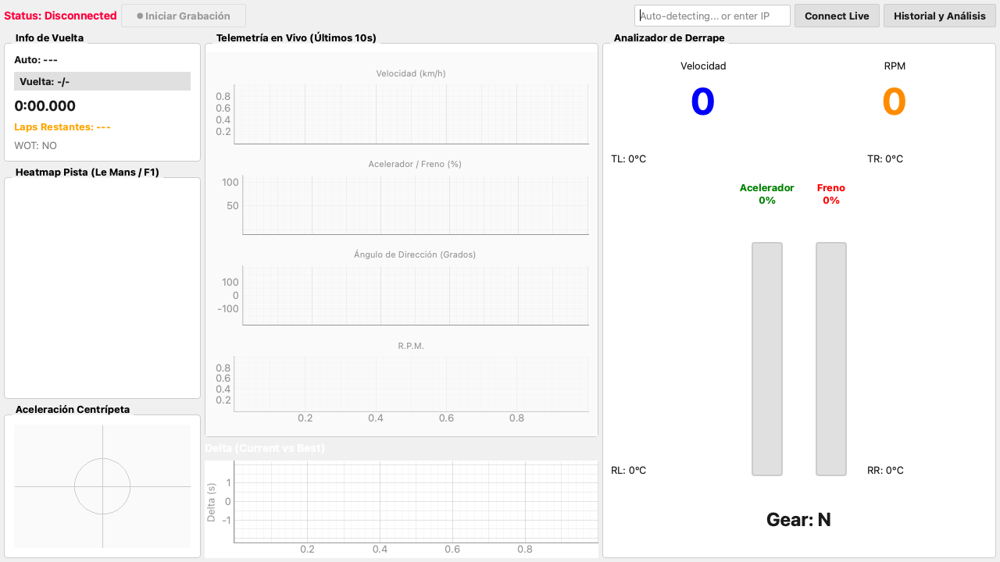
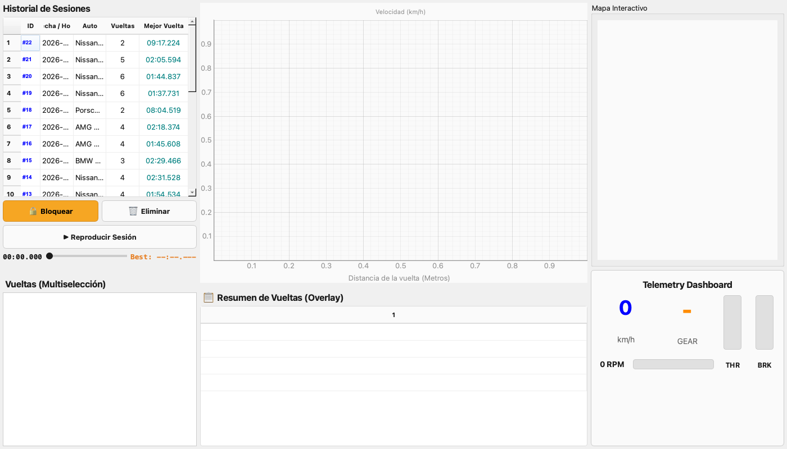

# 🏁 GT7 Telemetry Pro: F1 & Le Mans Edition



Una plataforma analítica de código abierto diseñada para transformar los datos crudos del Gran Turismo 7 en una consola de ingeniería virtual del más alto nivel, inspirada en los sistemas de telemetría de Fórmula 1 (Atlas) y Le Mans (MoTeC).
*Nota de diseño:* La aplicación cuenta con un esquema de colores "Modo Diurno" (Daylight Mode) de alto contraste, diseñado específicamente para ser visible bajo luz natural brillante, típico en muros de boxes y *paddocks* profesionales.

---

## 🏎️ Características Avanzadas del "Pit-Wall"

Este no es un simple visor de números; es un motor matemático y analítico en tiempo real diseñado para extraer la máxima ventaja competitiva.

### 📊 Análisis de Vuelta ("Ghosting" en vivo)
*   **Gestor de Vueltas Inteligente:** El sistema rastrea de forma transparente toda tu sesión, detectando automáticamente cruces de meta.
*   **Comparación de Delta Curve-by-Curve:** A través del *Delta Widget* lineal, el programa interpolea dinámicamente tu posición espacial (`x, z`) actual contra la telemetría de tu "Mejor Vuelta", graficando tu pérdida o ganancia en milisegundos precisos (Verde/Rojo).

### 🔥 Mapa Táctico Termodinámico (Heatmap)
*   **Dinámica Espacial:** Genera un trazado 2D del circuito que estás rodando de forma procedimental usando nubes de puntos de altísima densidad (10,000 puntos).
*   **Mapas de Temperatura de Pedales:** El trazado revela tu comportamiento:
    *   🔴 **Rojo intenso**: Zonas de frenado máximo.
    *   🟢 **Verde brillante**: Tramos a acelerador a fondo (Wide Open Throttle).
    *   🟡 **Gris/Amarillo**: Tramos de Lift & Coast.

### 🚨 Sistema Automático de Alertas 
*   **Auditoría de Daños:** Revisa a cada milisegundo tu motor y tus sistemas.
*   **Notificaciones Pit-Wall:** Si excedes drásticamente las revoluciones (riesgo de motor), o tus neumáticos sobrepasan los **105°C**, saltará una alarma crítica acústica y un banner visual exigiendo refrigeración inmediata.

### 🧮 Canales Matemáticos Propios
*   **Gestión de Combustible Avanzada:** El sistema no te dice "cuántos litros tienes", te dice cuántas *vueltas* exactas puedes completar con el nivel de agresividad y el gasto que registraste en la última vuelta.

---

## 🏁 Análisis Avanzado Post-Sesión (Zero-Friction UX)



Al terminar de correr o cargar una repetición SQLite, GT7 Telemetry Pro despliega su **Módulo de Análisis Avanzado**, optimizado para lectura instantánea sin gráficos abrumadores:

*   **Master View Unificada (Zero-Friction UX):** Navega por el historial de sesiones sin ventanas emergentes. La interfaz principal integra la tabla de historiales, la lista de vueltas multiselección y los gráficos en un solo layout de precisión.
*   **Live Telemetry Dashboard:** Un panel de instrumentos inspirado en los muros de boxes de F1 incorporado directamente bajo el mapa interactivo. Al reproducir una sesión, este panel revive la actuación del piloto mostrando acelerador, freno, RPM y marcha en vivo a 60 FPS (*Zero-stutter*).
*   **Gestión Segura de Datos (Lock & Delete):** Protege tus mejores carreras con el sistema de enclavamiento (`is_locked`), el cual bloquea visualmente y funcionalmente la sesión contra eliminaciones accidentales. Usa el botón de borrado masivo para purgar miles de paquetes y recuperar espacio en disco automáticamente (`VACUUM`).
*   **Identificación Topográfica Automática (Hard Filter):** Incorpora un Integrador Matemático a 60 Hz que calcula tu distancia y aplica un filtro físico estricto (margen dinámico de 50m y ponderación de relieve) contra una base de datos de **122 trazados oficiales** para detectar exactamente en qué pista corriste (¡incluso diferencia entre Fuji y Willow Springs!).
*   **Comparación de Múltiples Vueltas (Multi-Lap Overlay):** Selecciona múltiples vueltas al mismo tiempo (Checkboxes) y compáralas instantáneamente. La gráfica principal de Velocidad (Speed Trace) dibujará los trazados encimados con colores distintivos.
*   **Tablas de Datos Dinámicas (Multi-Columna):** ¡Adiós al ruido visual! Todos los datos complejos se resumen en **Data Grids**. Al comparar múltiples vueltas, las tablas generan columnas nuevas dinámicamente y el texto adopta el color de su respectiva gráfica para facilitar la lectura.

---

## 💾 Motor de Base de Datos SQLite (60 Hz)

El proyecto abandona las capturas crudas en favor de un enfoque *Big Data*:

*   **Sin Cuellos de Botella:** Utiliza el modo `WAL` (Write-Ahead Logging) de SQLite. Procesamiento en lotes asíncronos en hilos independientes, asegurando **0 drops** durante las intensas ráfagas de telemetría a 60 Hz.
*   **Base de Datos Maestra Única:** Adiós a la acumulación de cientos de archivos SQLite sueltos. Ahora todo el historial se guarda estructuradamente dentro de un único archivo maestro `telemetry_master.sqlite`, enlazando la telemetría a un registro centralizado de sesiones (con datos del auto, fecha, total de vueltas y récord).
*   **Grabación Manual y Detección Dinámica de Vehículo:** Tú decides cuándo grabar la sesión gracias a los controles dedicados en la interfaz (independientes de la conexión al juego). Para prevenir falsos positivos de los autos de la IA en la parrilla de salida, el sistema analiza estadísticamente toda la sesión y auto-corrige el ID del vehículo en la base de datos al detener la grabación.
*   **Data Structure:** Contiene tanto el Blob original de Polyphony Digital como columnas matemáticas listas (RPM, Marcha, Acelerador, Frenos, Tiempo, Vueltas) para que puedas importar la BD en Pandas, Excel o PowerBI.
*   **Replay Inteligente:** El reproductor interroga la BD maestra y expone un menú elegante de tu historial para cargar las sesiones anteriores, recreándolas de manera nativa sin abrir exploradores de archivos complejos.

---

## ⚙️ Arquitectura Limpia (Clean Architecture)

El código fuente está modularizado en tres componentes críticos y fuertemente desacoplados, idóneo para escalado o integraciones IoT.

1.  **`services/` (Capa de Ingestión):**
    *   Controla el Socket UDP (Puertos 33739/33740).
    *   Encriptación/Desencriptación nativa del Salsa20.
    *   Reproductor SQLite embebido para el Replay Mode.
2.  **`core/` (Capa de Motores & Dominio):**
    *   `LapManager`, `MathEngine`, `AlertEngine` analizan matrices numéricas a la velocidad del rayo.
    *   `database.py`: Contiene el sub-hilo (worker thread) SQLite.
3.  **`ui/` (Capa Gráfica):**
    *   Implementación robusta en **PyQt6** y gráficos hiperrápidos acelerados mediante **PyQtGraph**.

> 📖 *Para más detalles técnicos profundos de cómo operan los hilos (Threads), consulta [Architecture & Internals](.ai/architecture.md).*

---

## 🛠️ Instalación y Uso

### Prerrequisitos
- Python 3.10+
- Consola PS4/PS5 con Gran Turismo 7 (Debe estar conectado en tu red local WiFi/Ethernet).

### Configuración Rápida
1. Clona el proyecto y crea tu entorno virtual:
   ```bash
   python3 -m venv .venv
   source .venv/bin/activate
   pip install -r requirements.txt
   ```
2. Inicia el simulador del muro de boxes:
   ```bash
   python main.py
   ```
3. En la esquina superior derecha, **Introduce la IP local de tu consola PS4/PS5** (Ej: `192.168.1.68`) y presiona **Connect Live**. 
4. Entra a cualquier pista en GT7 y el Dashboard cobrará vida inmediatamente.

> **Importante:** La telemetría solo se emite cuando estás *físicamente manejando en pista o viendo una repetición*. Los menús, boxes, y versiones limitadas como "My First Gran Turismo" no emiten el handshake UDP.
