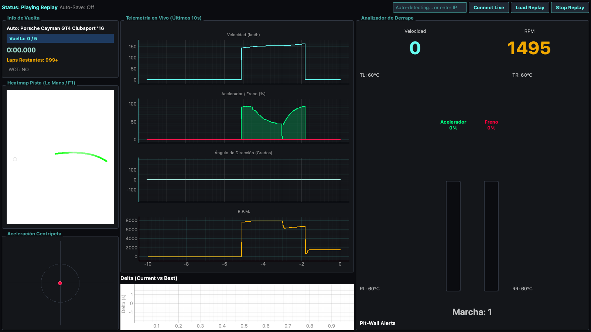

# 🏁 GT7 Telemetry Pro: F1 & Le Mans Edition



Una plataforma analítica de código abierto diseñada para transformar los datos crudos del Gran Turismo 7 en una consola de ingeniería virtual del más alto nivel, inspirada en los sistemas de telemetría de Fórmula 1 (Atlas) y Le Mans (MoTeC).

---

## 🏎️ Características Avanzadas del "Pit-Wall"

Este no es un simple visor de números; es un motor matemático y analítico en tiempo real diseñado para extraer la máxima ventaja competitiva.

### 📊 Análisis de Vuelta ("Ghosting" en vivo)
*   **Gestor de Vueltas Inteligente:** El sistema rastrea de forma transparente toda tu sesión, detectando automáticamente cruces de meta.
*   **Comparación de Delta Curve-by-Curve:** A través del *Delta Widget* lineal, el programa interpolea dinámicamente tu posición espacial (`x, z`) actual contra la telemetría de tu "Mejor Vuelta", graficando tu pérdida o ganancia en milisegundos precisos (Verde/Rojo).

### 🔥 Mapa Táctico Termodinámico (Heatmap)
*   **Dinámica Espacial:** Genera un trazado 2D del circuito que estás rodando de forma procedimental usando nubes de puntos de altísima densidad (10,000 puntos).
*   **Mapas de Temperatura de Pedales:** El trazado revela tu comportamiento:
    *   🔴 **Rojo intenso**: Zonas de frenado máximo.
    *   🟢 **Verde brillante**: Tramos a acelerador a fondo (Wide Open Throttle).
    *   🟡 **Gris/Amarillo**: Tramos de Lift & Coast.

### 🚨 Sistema Automático de Alertas 
*   **Auditoría de Daños:** Revisa a cada milisegundo tu motor y tus sistemas.
*   **Notificaciones Pit-Wall:** Si excedes drásticamente las revoluciones (riesgo de motor), o tus neumáticos sobrepasan los **105°C**, saltará una alarma crítica acústica y un banner visual exigiendo refrigeración inmediata.

### 🧮 Canales Matemáticos Propios
*   **Gestión de Combustible Avanzada:** El sistema no te dice "cuántos litros tienes", te dice cuántas *vueltas* exactas puedes completar con el nivel de agresividad y el gasto que registraste en la última vuelta.

---

## 💾 Motor de Base de Datos SQLite (60 Hz)

El proyecto abandona las capturas crudas en favor de un enfoque *Big Data*:

*   **Sin Cuellos de Botella:** Utiliza el modo `WAL` (Write-Ahead Logging) de SQLite. Procesamiento en lotes asíncronos en hilos independientes, asegurando **0 drops** durante las intensas ráfagas de telemetría a 60 Hz.
*   **Archivos Modulares:** Al salir a pista, se autogenera de manera transparente una base de datos local `GT7Session_..._db.sqlite`.
*   **Data Structure:** Contiene tanto el Blob original de Polyphony Digital como columnas matemáticas listas (RPM, Marcha, Acelerador, Frenos, Tiempo, Vueltas) para que puedas importar la BD en Pandas, Excel o PowerBI.
*   **Replay Player Integrado:** Carga tus bases de datos SQLite anteriores y relanza una sesión histórica completa dentro de las gráficas de interfaz, permitiéndote estudiar tus derrapes y vueltas mágicas en frio.

---

## ⚙️ Arquitectura Limpia (Clean Architecture)

El código fuente está modularizado en tres componentes críticos y fuertemente desacoplados, idóneo para escalado o integraciones IoT.

1.  **`services/` (Capa de Ingestión):**
    *   Controla el Socket UDP (Puertos 33739/33740).
    *   Encriptación/Desencriptación nativa del Salsa20.
    *   Reproductor SQLite embebido para el Replay Mode.
2.  **`core/` (Capa de Motores & Dominio):**
    *   `LapManager`, `MathEngine`, `AlertEngine` analizan matrices numéricas a la velocidad del rayo.
    *   `database.py`: Contiene el sub-hilo (worker thread) SQLite.
3.  **`ui/` (Capa Gráfica):**
    *   Implementación robusta en **PyQt6** y gráficos hiperrápidos acelerados mediante **PyQtGraph**.

> 📖 *Para más detalles técnicos profundos de cómo operan los hilos (Threads), consulta [Architecture & Internals](.ai/architecture.md).*

---

## 🛠️ Instalación y Uso

### Prerrequisitos
- Python 3.10+
- Consola PS4/PS5 con Gran Turismo 7 (Debe estar conectado en tu red local WiFi/Ethernet).

### Configuración Rápida
1. Clona el proyecto y crea tu entorno virtual:
   ```bash
   python3 -m venv .venv
   source .venv/bin/activate
   pip install -r requirements.txt
   ```
2. Inicia el simulador del muro de boxes:
   ```bash
   python main.py
   ```
3. En la esquina superior derecha, **Introduce la IP local de tu consola PS4/PS5** (Ej: `192.168.1.68`) y presiona **Connect Live**. 
4. Entra a cualquier pista en GT7 y el Dashboard cobrará vida inmediatamente.

> **Importante:** La telemetría solo se emite cuando estás *físicamente manejando en pista o viendo una repetición*. Los menús, boxes, y versiones limitadas como "My First Gran Turismo" no emiten el handshake UDP.
