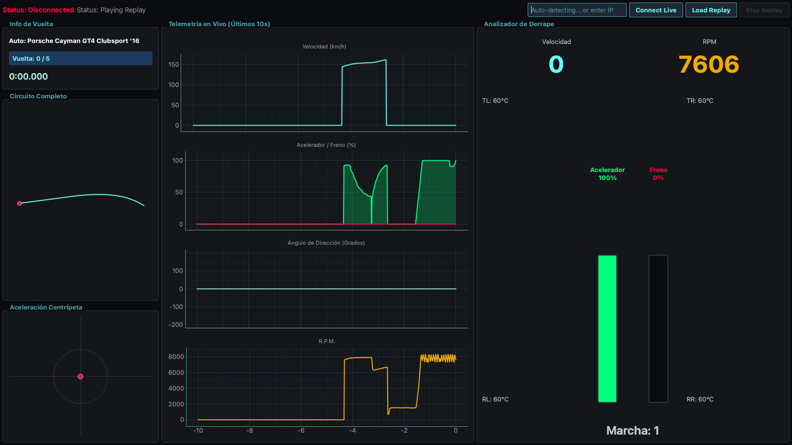

# GT7 Telemetry Pro 🏎️📊

[](https://www.python.org/downloads/)
[](https://opensource.org/licenses/MIT)
[](#)

**GT7 Telemetry Pro** es una aplicación de escritorio profesional de ultra baja latencia diseñada para capturar, descifrar y visualizar la telemetría en tiempo real desde **Gran Turismo 7 (PS4/PS5)**.

Al prescindir de tecnologías web (como Electron o navegadores embebidos), la aplicación ofrece un rendimiento puro a **60 FPS constantes**, ideal para analizar tus trazadas, fuerzas G, uso de pedales y tiempos por vuelta en tiempo real o mediante repeticiones guardadas.



---

## 🚀 Características Principales

*   **⚡ Rendimiento Nativo**: Interfaz gráfica desarrollada en `PyQt6` y `pyqtgraph` para asegurar cero latencia visual.
*   **📡 Telemetría en Vivo (Live)**: Decodificación criptográfica (*Salsa20*) en tiempo real conectándose directamente a la PlayStation en tu red local.
*   **💾 Grabación y Reproducción (Replays)**: Guarda tus sesiones de pista en formato `.gt7` y reprodúcelas más tarde para estudiar tu rendimiento al milímetro.
*   **🏎️ Auto-Detección de Vehículos**: Base de datos integrada con cientos de vehículos de GT7 para identificar automáticamente el coche que estás conduciendo.
*   **📊 Análisis Detallado**:
    *   Gráfico de Velocidad (km/h) y R.P.M.
    *   Telemetría de Pedales (Acelerador, Freno, Ángulo de Dirección).
    *   Fricción y Fuerzas G (Círculo de tracción lateral y longitudinal).
    *   Mapa del Circuito generado en vivo.

---

## 🛠️ Arquitectura de Software

Este proyecto está construido bajo estrictos principios de diseño para asegurar el máximo rendimiento:
1. **Clean Architecture**: Separación estricta entre la UI (`ui/`), la lógica de conexión (`services/`) y los modelos de datos (`core/`).
2. **Multi-Threading Asíncrono**:
    *   `Hilo de Red`: Recibe los paquetes crudos (UDP) sin bloquear la interfaz.
    *   `Hilo de Procesamiento`: Descifra y parsea estructuras binarias dinámicamente.
    *   `Hilo Principal`: Exclusivo para renderizar la interfaz a 60 hercios fluidos.

---

## ⚙️ Requisitos del Sistema

*   **Python**: Versión 3.10 o superior.
*   **Sistema Operativo**: Windows 10/11 o macOS (Intel/Apple Silicon).
*   **Red**: Tu PC/Mac debe estar en la misma subred que la consola PS4/PS5.
*   **Juego**: Copia completa de Gran Turismo 7 *(Las demos o pruebas como "My First Gran Turismo" pueden no tener habilitada la API de telemetría)*.

---

## 📦 Instalación y Uso

1. **Clonar el repositorio**:
   ```bash
   git clone https://github.com/tu-usuario/gt7-telemetry-pro.git
   cd gt7-telemetry-pro
   ```

2. **Crear entorno virtual e instalar dependencias**:
   ```bash
   python3 -m venv .venv
   source .venv/bin/activate  # En Windows: .venv\Scripts\activate
   pip install -r requirements.txt
   ```

3. **Ejecutar la aplicación**:
   ```bash
   python main.py
   ```

### 🎮 Cómo conectar al juego
Abre la aplicación, asegúrate de que tu PS4/PS5 está encendida.
1. Ingresa la dirección IP de tu PlayStation (Opcional, el sistema soporta auto-descubrimiento en la mayoría de redes).
2. Haz clic en **"Connect Live"**.
3. **¡Importante!** Entra a una carrera, contrarreloj o práctica libre en GT7. La consola *no transmite datos mientras estás en el menú principal*.

---

*Desarrollado con ❤️ para la comunidad de SimRacing.*
